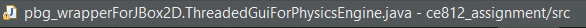
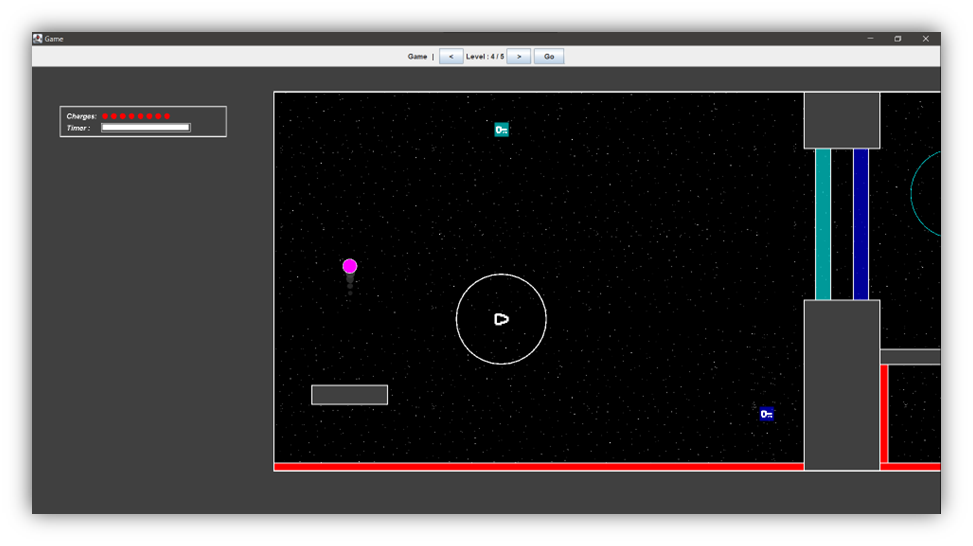
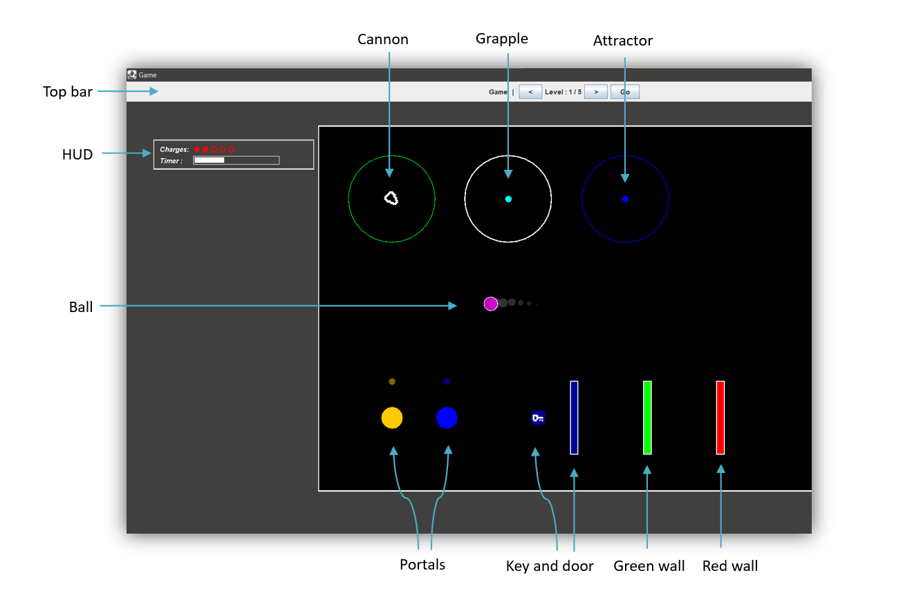

# **CE812-07-SP Main assignment**

# Introduction
This repository contains the source code of a game made for coursework assignment of module CE812-07-SP. 

# How to run the project?

## Running from IDE

The main function of the project is in "ThreadedGuiForPhysicsEngine.java". 
Open a command line / terminal from "ce812_assignment" directory and run the following command.

> java -classpath "bin" pbg_wrapperForJBox2D.ThreadedGuiForPhysicsEngine

Alternatively, you can run the project using "ThreadedGuiForPhysicsEngine.java" file with your choice of IDE. 

## Running using jar file
Open a command line from the "build" directory, and run the following command.
 > java -jar "game.jar"

# Description
This is a world-controlled puzzle game where the goal of the player is to navigate a ball to reach a destination point using the elements in the world. The game world is populated with elements that can help the ball navigate or hinder the ball in many ways. However, the player's ability to control the ball is significantly limited, requiring strategic planning and a keen understanding of the game's physics and environmental factors. Success in the game hinges on the player's capacity to leverage the world elements to their advantage, guiding the ball through obstacles and challenges to reach the end goal.

# How to start the game?

In the top bar, use the left "<" and right button ">" buttons on the top bar to select a level and press on "Go" button to start the game. It is recommended to play the game with the screen maximized.

# Instructions
- Navigate the ball towards the right of the screen using varieties of interactable elements present in game world. 
- Avoid walls that are red in color. 
- The level is completed when the ball touches a green wall.

# Controls

| **Key bindings** | **Action** |
| --- | --- |
| Space | Activate or deactivate interactive elements around the ball |
| Arrow keys | Specify direction, also used to control some interactable elements |
| X   | Charging ability |
| C   | Time slowing ability |
| T   | Toggle debug-draw |
| R   | Restarts current level |

# Elements in game

The game comprises of multiple interactive elements and each of them interacts with the ball in a unique way. Most of them demonstrate a unique physics concept. Following are the elements found in the game.

- Ball
- Red walls
- Goal
- Cannon
- Grapple
- Attractor
- Portal
- Jump pad
- Keys and doors
- Moving walls

Details and interactions of each element are given below.

## Ball

This is the main element in the game that the player can control.

## Red Walls

These are walls that are red in color. These should be avoided by the player as they can kill the ball once it comes in contact with the wall.

## Goal
These are walls that are green in color. Level would be complete when the ball touches one of these walls.

## Cannon

Cannon is an interactable element that has the ability to load and launch the ball with a predetermined force in any desired direction. Interactable controls are given below.

| **Key binding** | **Action** |
| --- | --- |
| Space key | Loads the ball in the cannon - When the ball is within the interactable range.  Launches the ball - When the ball is already loaded. |
| Left / right arrow | Controls the launch angle of the ball (Only works when the ball is loaded in the cannon) |

## Grapple

Grapple is an interactable element that holds the ball using a spring with tension. Interactable controls are given below.

| **Key binding** | **Action** |
| --- | --- |
| Space key | Connects the ball with a spring - When the ball is within the interactable range.  Releases the ball - When the ball is already held by the spring. |
| Left / right arrow | Swings the ball in respective direction - Works when the ball is attached. |

## Attractor
This is an interactable element that pulls the ball towards the center when the ball is in range.

| **Key binding** | **Action** |
| --- | --- |
| Space key (Hold) | Pulls the ball towards the center of this element - When the ball is in the interactable range |

## Portal

Portal always comes in pairs. It can teleport the ball from one portal to the pair portal. The out direction is indicated by a small circle around the portal.

## Jump pad

Jump pad has a high restitution and can increase the linear velocity of the ball when it makes contact with the jump pad (Similar to the element in pin ball).

## Key and door

Doors are elements in the world that can be disabled by using corresponding key. Pathways blocking the goal can be disabled when the ball touches the key.

## Moving walls

These are walls that move over certain waypoints in the world. Beware the red ones can kill the ball when touched.

# Abilities

The ball has some abilities that the player can leverage to navigate around the map.

## Charging ability

This ability can be used to launch the ball in a set of directions. The number of charges available per level are displayed in the player HUD. Player should use these conservatively as few charges are necessary for the player to complete the level.

### How to use?
- Hold the X key to enter charge mode.
- Change the charge direction by pressing and holding the appropriate arrow keys.
- Release X key.

## Time slowing ability

Player can slowdown time in the game to analyse and make decisions in fast paced sections of the game. This ability consumes energy. Energy bar is displayed in the Player HUD. Energy regenerates when the ability is not in use.

Note: 30% of total energy is required to activate this ability.

### How to use?
- Press and hold the C key on the keyboard.

